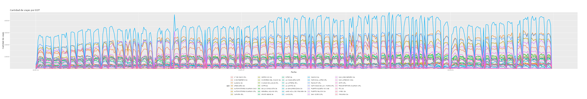
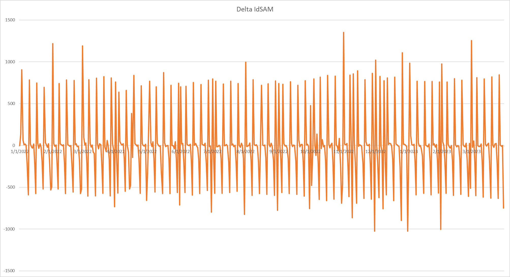
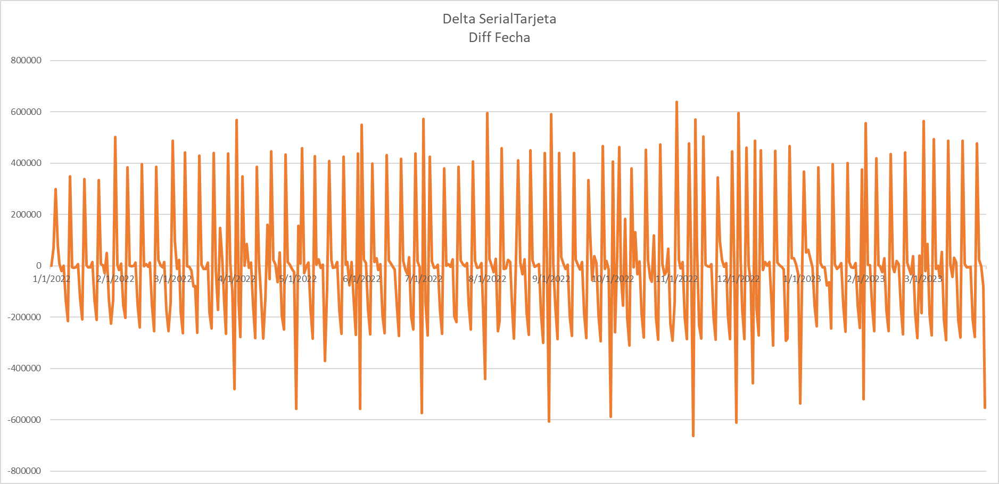
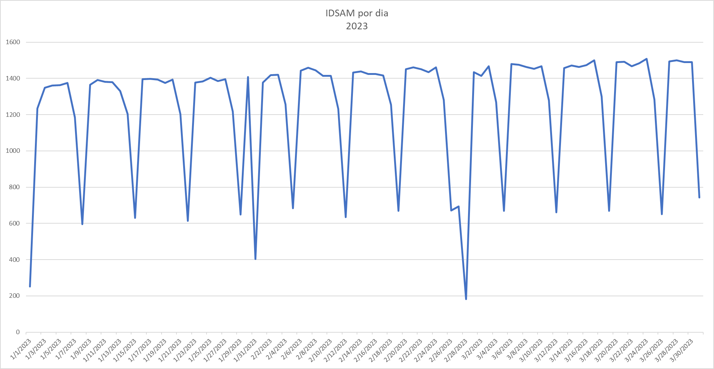
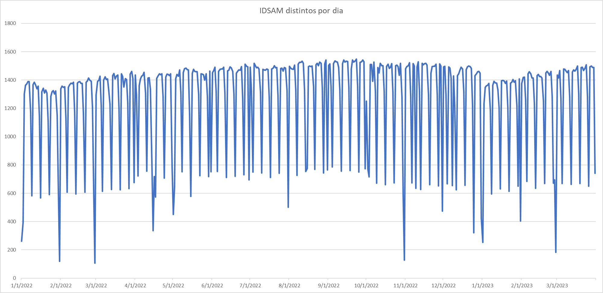
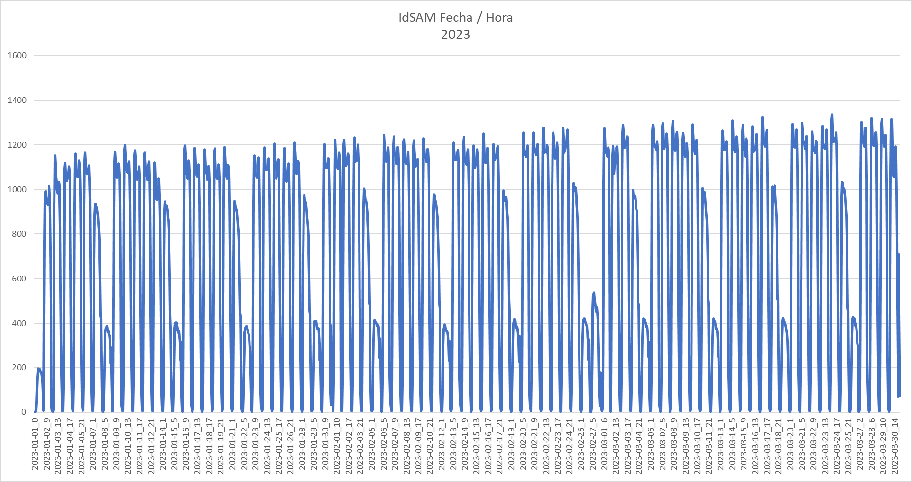
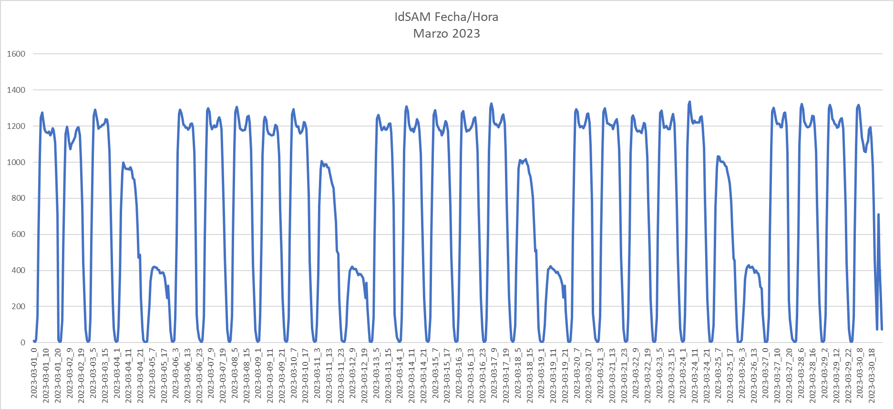

# monda-guasu

**ACA ESTA EL DATASET**
|[**8 CDs**](https://drive.google.com/drive/folders/12EbE0PEEnCjUVjhzMDNa1W7M9tR4ZzwW)|

## Contexto

* El 2 de marzo, *Mauricio Maluff* presentó una solicitud de información al viceministerio de transporte incluyendo datos del sistema de billetaje electrónico, para verificar el cumplimiento de frecuencias de buses que dicta el viceministerio
* El 31 de marzo, pasados los 15 días sin respuesta, los abogados *Jorge Rolón Luna, Belén González y Romina Sotelo* presentaron una acción de amparo para obligar al viceministerio a cumplir con su obligación de compartir los datos
* El 3 de abril, tras presión ciudadana debido a las reguladas, el viceministerio responde a la solicitud con [**8 CDs**](https://drive.google.com/drive/folders/12EbE0PEEnCjUVjhzMDNa1W7M9tR4ZzwW) incluyendo datos del sistema de billetaje electrónico de enero de 2022 a marzo de 2023

## Scripts

La idea de este repositorio es colocar diversos scripts en R para que cualquier persona con los conocimientos minimos básicos pueda hacer los analisis que se hicieron, eventualmente podrán corregir y cambiar parametros para aprender a hacer análisis de datos sobre este data set.

Este trabajo esta en curso, por lo que se ira actualizando día a día.

## Diccionario de Datos

Tenemos varios conjuntos de datos que fueron proveídos:

### Transacciones

|Campo|Descripción|Tipo de Dato|
|-----|-----------|------------|
|serialtarjeta|Identificador de la tarjeta. Puede ser nominal o no, por lo que se puede llegar a la identidad del pasajero. Para nuestro análisis asumimos que es un pasajero|hash md5|
|idsam|Identificador del chip instalado en el equipo verificador. No necesariamente permanece con el mismo equipo verificador. Puede cambiar de bus, inclusive de línea o de EOT. Asumimos que identifica al bus|string|
|fechahoraevento|Timestamp del inicio del viaje|timestamp|
|producto|Tipo de producto donde:  - CR. Crédito o saldo negativo de la tarjeta - ES. Uso Especial (Estudiante o discapacitado) - MO. Monedero o uso normal|string|
|montoevento|Monto del evento descontado de la tarjeta. |entero|
|consecutivoevento|Identificador consecutivo de numero de transacción realizado con la tarjeta identificada con serialtarjeta|entero|
|identidad|Se refiere al propietario del validador donde: - 1. VMT - 2. MAS - 3. JAHA |entero|
|tipoevento|Tipo de evento donde: - 4. Viaje Normal - 8. Devolución - 10. Recarga de la tarjeta. - 14. Devolucion. Utilizaremos solo los del tipo 4|punto flotante|
|longitude|Longitud geográfica|punto flotante|
|Latitude|Latitude geográfica|punto flotante|
|idrutaestacion|Identificador de ruta asociado a una EOT. Ver tabla adicional|string|
|tipotransporte|Tipo de transporte donde - 0. Bus municipal interno - 1. Normal  - 3. Diferencial|entero|

### Tabla de Rutas

|Campo|Descripción|Tipo de Dato|
|-----|-----------|------------|
|ideot|Id de la EOT en la tabla|entero|
|eot | Empresa Operadora de Transporte | string|
|troncal | identificador de troncal|string|
|idrutaestacion| Identificador hexadecimal de la ruta|string|
|ramal|descripción del ramal|string|
|estado|descripción del ramal|string|

## Algunos gráficos

### Total de viajes por EOT

### Diferencia de Buses con el día anterior

### Diferencia de Pasajeros con el día anterior

### Buses por dia solo año 2023

### Buses por dia todo el dataset

### Buses por dia por hora del año 2023

### Buses por dia por hora solo Marzo 2023

## Otros repositorios

Existen otras personas que estuvieron analizando el mismo data set, estos son esos repositorios.

* [Pablo](https://github.com/pabloacastillo/billetaje-electronico-py-2022)
* [Karl](https://github.com/Karlheinzniebuhr/billetaje_electronico)
* [Mateo](https://github.com/torresmateo/opama)
* [kike](https://github.com/egkike/billetaje)

Envía un mensaje para agregarte. Nombre y URL del repositorio.
