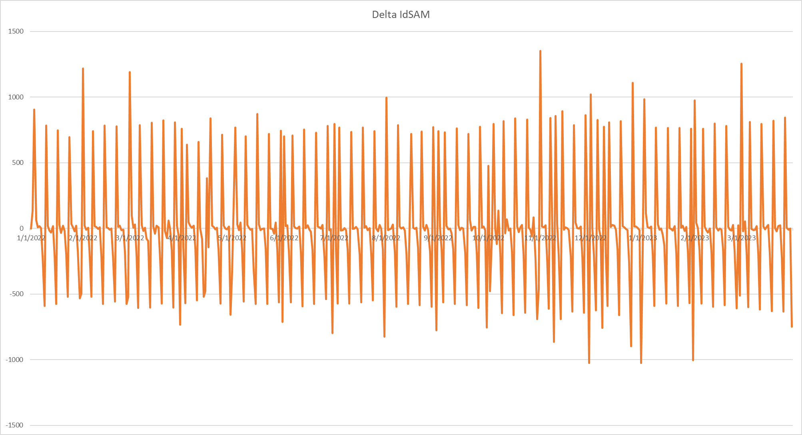
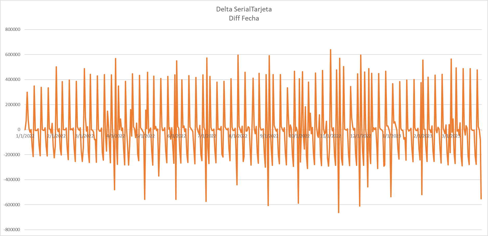
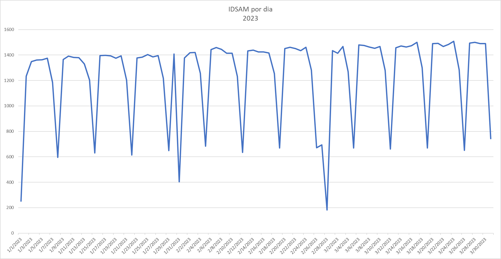
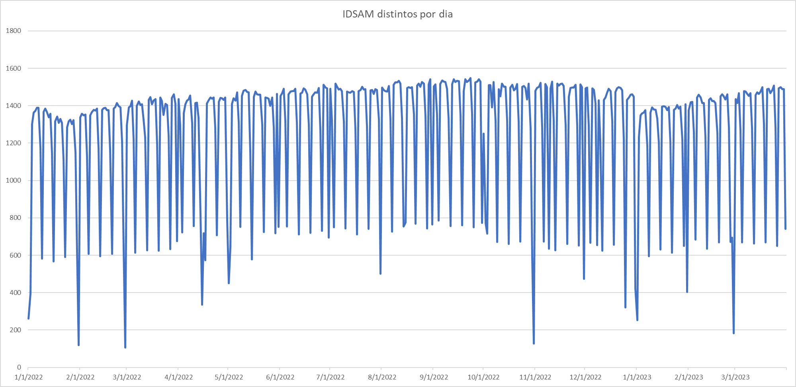
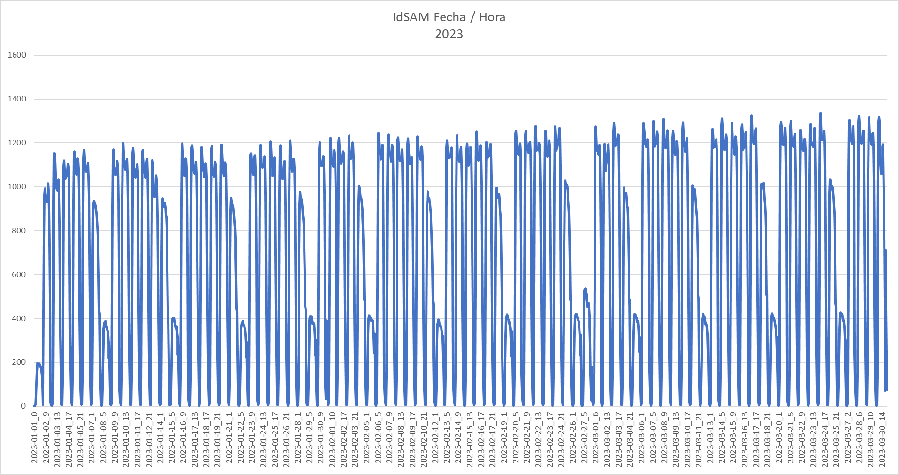
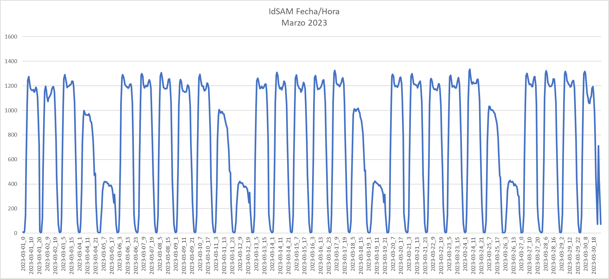

# monda-guasu

## Contexto

* El 2 de marzo, *Mauricio Maluff* presentó una solicitud de información al viceministerio de transporte incluyendo datos del sistema de billetaje electrónico, para verificar el cumplimiento de frecuencias de buses que dicta el viceministerio
* El 31 de marzo, pasados los 15 días sin respuesta, los abogados *Jorge Rolón Luna, Belén González y Romina Sotelo* presentaron una acción de amparo para obligar al viceministerio a cumplir con su obligación de compartir los datos
* El 3 de abril, tras presión ciudadana debido a las reguladas, el viceministerio responde a la solicitud con [**8 CDs**](https://drive.google.com/drive/folders/12EbE0PEEnCjUVjhzMDNa1W7M9tR4ZzwW) incluyendo datos del sistema de billetaje electrónico de enero de 2022 a marzo de 2023

## Scripts

La idea de este repositorio es colocar diversos scripts en R para que cualquier persona con los conocimientos minimos básicos pueda hacer los analisis que se hicieron, eventualmente podrán corregir y cambiar parametros para aprender a hacer análisis de datos sobre este data set.

Este trabajo esta en curso, por lo que se ira actualizando día a día.

## Diccionario de Datos

|Campo|Descripción|Tipo de Dato|
|-----|-----------|------------|
|serialtarjeta|Serial de la tarjeta que identifica al pasajero. Asumimos que identifica a un pasajero|hash|
|idsam|Identificador único de dispositivo validador instalado en el bus. Asumimos que identifica al bus|hash|
|fechahoraevento|Timestamp del inicio del viaje|timestamp|
|producto|Tipo de producto (Aparentemente CR=Crédito, ES=Especial, MO=Monedero)|string|
|montoevento|Monto del evento descontado de la tarjeta (el monto podría estar relacionado a otros campos)|entero|
|consecutivoevento|Consecutivo del evento, contador de tipo de evento asociado a serialtarjeta y otros campos|entero|
|identidad|Identidad (valores 2 y 3)|entero|
|tipoevento|Tipo de evento (4 uso del producto / 8 ? / 10 Recarga del producto)|punto flotante|
|longitude|Longitud geográfica|punto flotante|
|Latitude|Latitude geográfica|punto flotante|
|idrutaestacion|Identificador de ruta asociado a una EOT|string|
|tipotransporte|Tipo de transporte (probablemente normal y diferencial)|entero|

## Algunos gráficos

### Diferencia de Buses con el día anterior

### Diferencia de Pasajeros con el día anterior

### Buses por dia solo año 2023

### Buses por dia todo el dataset

### Buses por dia por hora del año 2023

### Buses por dia por hora solo Marzo 2023

## Otros repositorios

Existen otras personas que estuvieron analizando el mismo data set, estos son esos repositorios.

* [Pablo](https://github.com/pabloacastillo/billetaje-electronico-py-2022)
* [Karl](https://github.com/Karlheinzniebuhr/billetaje_electronico)
* [Mateo](https://github.com/torresmateo/opama)

Envía un mensaje para agregarte. Nombre y URL del repositorio.
